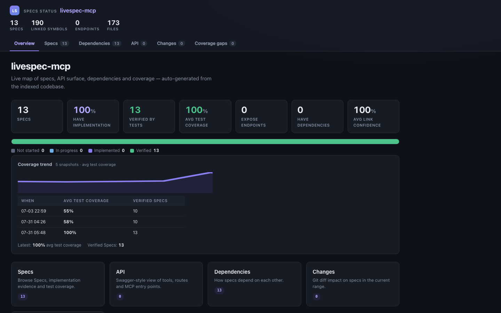

# livespec

[](https://pypi.org/project/livespec/)
[](https://www.python.org/downloads/)
[](LICENSE)
[](https://github.com/Rixmerz/livespec/actions)

> **Public beta (v0.31).** Local-first code intelligence for AI agents.
> Call graph, impact analysis, and Spec ↔ code traceability. Search is
> **FTS5-only** (no embeddings). Dead/legacy findings are **graph evidence**,
> not production traffic — confirm with APM/logs before deleting. Spec and
> docs mutation tools are plugin-gated. Pin: `uvx livespec@0.31.3`.
>
> **License: [GNU AGPL v3](LICENSE)** (`AGPL-3.0-only`). If you modify
> livespec and offer it over a network (MCP host, SaaS, internal API), you
> must provide the corresponding source under the same license.
> Corporate adoption notes and a first-contact compliance template:
> [`docs/AGPL_COMPLIANCE_CONTACT.md`](docs/AGPL_COMPLIANCE_CONTACT.md).

**Code intelligence for AI agents** — call graph, impact analysis, and
bidirectional **Spec ↔ code** traceability (functional requirements, ADRs,
NFRs, and other spec kinds). Local-first, zero external services.

<p align="center">
  
</p>
<p align="center"><em>Spec Explorer (docs plugin) on this repo — Specs, coverage, and linked symbols at a glance.</em></p>

### Who this is for / not for

| For | Not for |
|-----|---------|
| Agents cold-opening an unfamiliar repo | “Delete all unused code” without APM/logs |
| Impact analysis before a refactor or PR | Deep semantic search (vectors removed in 0.29) |
| Spec ↔ code / OpenSpec traceability | Indexing a parent folder of many unrelated repos |
| Polyrepo HTTP flows via `group_db` | Replacing tests, human review, or runtime debugging |

Ships as a **Claude Code plugin** bundling three things: the **MCP server**
(the tools), a specialized **subagent**, and a preloaded **Skill** (the
operating manual). Everything an agent sees — the plugin, subagent, Skill, and
MCP tool namespace — is `livespec`. The PyPI distribution and console command
are also **`livespec`** (`uvx livespec@0.31.3` / `pip install livespec`).
The legacy command alias `livespec-mcp` still works on the same entry point.

Battle-tested on real codebases. Four releases of compounding wins
on the same Django 5.1.4 queries:

| Tool on Django (40K symbols) | v0.8 | v0.9 | v0.10 | v0.14 |
|---|---:|---:|---:|---:|
| `find_dead_code` candidates | 824 | 514 | 348 | **344** (−58% cumulative) |
| `find_endpoints(framework='django')` | 20 | **162** (+8×) | 162 | 162 |
| `quick_orient` p95 | ~60 ms | ~60 ms | ~60 ms | ~60 ms |
| Partial reindex (touch 1 file, Django) | — | ~7 s | — | **1.4 s** |

Validated across 5 distinct agent profiles (exploration, refactor,
Spec flow, Django bugfix, TypeScript feature) — see
[`docs/AGENT_USAGE_DATA.md`](docs/AGENT_USAGE_DATA.md).

> Want the agentic flow without reading further?
> - **MCP prompt `agent_playbook`** — how to use tools *and* annotate code (`@spec:`).
> - [`docs/AGENT_QUICKSTART.md`](docs/AGENT_QUICKSTART.md) — 10-step cold-open flow.
> - [`docs/AGENT_PLAYBOOK.md`](docs/AGENT_PLAYBOOK.md) — same content as the prompt.

## 30-second tour

```bash
# Wire as an MCP server next to your editor (claude.ai/code, Cursor, ...).
# Every tool call carries workspace="/abs/path" — one server, N repos.
uvx livespec@0.31.3
# alias still works: livespec-mcp
```

```jsonc
// First call: cold-index the workspace once
> index_project()
{ "files_total": 2898, "symbols_total": 39789, "edges_total": 465179,
  "languages": {"python": 2786, "javascript": 112}, "watcher_started": false }

// Composite first-contact on an unfamiliar symbol
> quick_orient(qname="django.contrib.auth.middleware.AuthenticationMiddleware.process_request")
{ "kind": "method", "is_entry_point": false,
  "callers_count": 56, "callees_count": 3,
  "top_callees": [
    {"qualified_name": "django.contrib.auth.middleware.get_user", "pagerank": 0.000024},
    {"qualified_name": "django.utils.functional.SimpleLazyObject", "pagerank": 0.000209},
    {"qualified_name": "django.core.exceptions.ImproperlyConfigured", "pagerank": 0.000872}
  ],
  "specs": [] }

// Wider blast radius on a Spec-active codebase
> analyze_impact(target_type="spec", target="auth-user-login")
{ "spec_id": "auth-user-login", "implementing_symbols": [...],
  "dependent_specs": ["auth-session-rotation", "auth-audit-trail"],
  "impacted_callers": [...] }
```

Built for the questions an agent asks on an unfamiliar codebase:

- ¿Qué código implementa la requirement `auth-user-login`?
- Si modifico `auth.verify`, ¿qué Specs y qué llamadores se ven afectados?
- ¿Qué módulos no tienen ningún Spec asociado?
- ¿Qué Specs dependen de `auth-user-login` transitivamente?

Spec traceability is the differentiator. Most code-intel tools stop at "what
calls this function?". livespec layers Spec ↔ code links (functional
requirements, ADRs, NFRs, and other kinds) on top so an agent on a
serious-software-shop codebase can answer *"changing this function affects
`auth-user-login`, `auth-session-rotation` and 3 dependent Specs"* in one
round-trip. Spec agentic
tools ship in the default surface; Spec mutation/management tools live in
the `livespec-spec` plugin. Plugins register at boot (multi-tenant: every
`workspace=` has its own DB), but **`PluginVisibilityMiddleware`** hides
mutation/doc tools from `tools/list` until that workspace has `spec`/`doc`
rows — or you set `LIVESPEC_PLUGINS=spec` / `=all` in MCP config.

### What "living" actually means here

| Layer | Lives | How |
|---|---|---|
| Symbol index | ✅ | xxh3 content-hash incremental, run `index_project` on demand |
| Call graph + edges | ✅ | re-resolved on every change; persistent `symbol_ref` |
| Spec ↔ code links | ✅ | auto-scan of `@spec:` annotations after every `index_project` |
| Spec ↔ Spec graph | ✅ | explicit, cycle-checked; `link_spec_dependency` (plugin) |
| Drift detection | ✅ | body_hash + signature_hash on every symbol; `list_docs(only_stale=True)` (plugin) |
| **Generated docs content** | ❌ on-demand | `generate_docs` (plugin) needs an LLM-capable caller or an MCP host that supports sampling. Drift is *detected*, not *fixed*. |

So: traceability is live, docs are not. If your workflow is "give me an
agent that always knows which code implements which spec, and which
tests probably break when X changes" — this is exactly what the project is
good at. If you wanted "writes my doc comments while I sleep" — not yet.

## Stack

- **FastMCP 3.x** (stdio transport; `fastmcp>=3,<4`)
- **SQLite** (single `docs.db` file, ACID, WAL, explicit migration framework)
- **tree-sitter + tree-sitter-language-pack** for multi-language parsing
- **Python `ast`** for high-precision Python extraction
- **NetworkX** for call graph and topological impact analysis (cached per
  index run)

100% local, zero external services, zero API keys required.

## Language support

Honest table — only languages with a passing test suite are claimed.

| Language | Status | What's covered |
|----------|--------|----------------|
| **Python** | ✅ Tested | Functions, classes, methods, decorators, calls — uses `ast` for full precision. Imports drive scoped resolution (P0.4). |
| **Go** | ✅ Tested | Functions, struct types via `type_spec`, struct methods, calls. **Scoped resolution** via `import` + alias (P1.A2 v0.4). |
| **Java** | ✅ Tested | Classes, methods, calls (`method_invocation`) |
| **JavaScript** | ✅ Tested | Function declarations, **arrow functions** assigned to const/let, classes, methods. **Scoped resolution** via ES6 `import` and CommonJS `require` (P1.A1 v0.4). |
| **TypeScript** | ✅ Tested | Same as JS plus typed signatures (`.ts` and `.tsx`). **Scoped resolution** via ES6 `import` (P1.A1 v0.4). |
| **Rust** | ✅ Tested | Free functions, struct/enum types, **`impl` block methods** as `Type::method`, traits. **Scoped resolution** via `use` declarations (P4.A3 v0.5). |
| **Ruby** | ✅ Tested | `def`, `class`, `module`, `singleton_method`, calls. Best-effort scoped resolution via `require_relative` + receiver field (P1.A4 v0.4). |
| **PHP** | ✅ Tested | Classes, methods, function/method/scoped call expressions. Best-effort scoped resolution via `use Namespace\X` for `Class::method()` (P1.A4 v0.4); instance-method calls are not scoped. |
| C, C++, C#, Kotlin, Swift, Scala | ⚠️ Untested | The generic tree-sitter extractor will *attempt* to parse these (they're listed in `EXT_LANGUAGE`) but no test suite covers them. Symbol coverage may be partial — open an issue with a fixture if you need a specific language hardened. |

The extractor is a heuristic over hardcoded tree-sitter node types
(`_DEF_NODE_TYPES`, `_CALL_NODE_TYPES` in `extractors.py`); it intentionally
trades completeness for simplicity. Use the per-language tests in
`tests/test_extractors.py` as the contract.

## Install

```bash
uv venv --python 3.12
uv pip install -e ".[dev]"
```

## Run as MCP server

```bash
uvx livespec@0.31.3   # preferred — PyPI distribution name is `livespec`
livespec              # after `pip install livespec` / `uv tool install livespec`
livespec-mcp          # console alias of the same entry point
```

> The **product, package, and primary command** are `livespec`
> (`pip install livespec`, `uvx livespec@0.31.3`). The `livespec-mcp` command
> remains as a back-compat alias only.

Every tool call requires `workspace="/abs/path"` (no cwd or env fallback
since v0.12). Persistent state lives in `<workspace>/.mcp-docs/docs.db`.

### Headless CLI (v0.14)

The same indexing pipeline without an MCP host — for cron, systemd
timers, pre-commit hooks, CI:

```bash
livespec-mcp index /path/to/repo [--force]             # JSON stats to stdout
livespec-mcp status /path/to/repo                      # index status JSON
```

### Claude Code / Cursor wiring

**Claude Code plugin** — published in the `rixmerz` owner marketplace:

```bash
claude plugin marketplace add Rixmerz/claude-plugins
claude plugin install livespec@rixmerz
```

Update with:

```bash
claude plugin marketplace update rixmerz
claude plugin update livespec
```

A plugin update takes effect on restart. To install from a clone instead, run
`claude plugin marketplace add <path-to-clone>` and
`claude plugin install livespec@livespec-dev` — a clone registers under its own
name so it cannot displace the published index.

Or wire the MCP server directly in Cursor / Claude (local checkout or `uvx`):

```json
{
  "mcpServers": {
    "livespec": {
      "command": "uv",
      "args": ["--directory", "/path/to/livespec", "run", "livespec-mcp"]
    }
  }
}
```

**Multi-repo:** pass `workspace="/abs/path/to/project"` on **every** tool call (required).
No `LIVESPEC_WORKSPACE` — switching repos is only a different `workspace=` value.
The server caches up to 8 workspaces (LRU); no MCP restart.

### Keep the index fresh (Claude Code hook)

The watcher (`index_project(watch=True)`) works but is a race trap when
multiple agents write concurrently. For single-user Claude Code sessions
a `PostToolUse` hook is simpler and exact — re-index incrementally after
every file edit (hash-skip makes no-op runs cheap):

```json
{
  "hooks": {
    "PostToolUse": [
      {
        "matcher": "Edit|Write|NotebookEdit",
        "hooks": [
          {
            "type": "command",
            "command": "livespec-mcp index \"$CLAUDE_PROJECT_DIR\" >/dev/null 2>&1 &"
          }
        ]
      }
    ]
  }
}
```

The trailing `&` keeps the hook non-blocking; the next tool call sees a
fresh index.

### FastAPI integration

Three steps to serve the Spec Explorer from your API — no manual wiring unless
you disable autowire:

1. **Install** livespec in the same environment as your app
   (`pip install livespec` or `uv add livespec`).

2. **Index once** (MCP tool or CLI). If the repo has `app = FastAPI(...)` in
   `main.py` or `app.py`, `index_project` auto-builds `.mcp-docs/explorer/`
   and appends `mount_explorer(app)` when `[explorer] auto_mount = true`
   (default in `.livespec.toml`).

3. **Open** `http://localhost:<port>/explorer/` — the Overview tab shows
   spec status, coverage trend, and navigation into API / Changes /
   Coverage gaps. For a quick try without your app:

   ```bash
   livespec-mcp index /path/to/your/repo
   livespec-mcp explorer serve /path/to/your/repo
   # → http://127.0.0.1:8765/explorer/
   # API tab: live MCP Try it (read-only tools by default)
   # → http://127.0.0.1:8765/explorer/
   ```

Set `[explorer] auto_mount = false` in `.livespec.toml` if you prefer runtime mount:

```python
from livespec_mcp.explorer import enable_explorer
enable_explorer(app)  # no main.py patch
```

The API tab **Try it** sends `fetch` to your base URL (CORS must allow the Explorer origin).

### One-shot install (rule + skill + index + autowire)

```bash
livespec-mcp fastapi init /path/to/your/fastapi-repo
```

Writes:

| Path | Purpose |
|------|---------|
| `.livespec.toml` | `[explorer]` defaults |
| `.mcp-docs/explorer/` | Spec Explorer bundle |
| `.cursor/rules/livespec-fastapi.mdc` | Agent rule (FastAPI globs) |
| `.cursor/skills/livespec-fastapi/SKILL.md` | Session workflow skill |
| `.livespec/SESSION_PROMPT.md` | Copy-paste chat opener |

Appends `mount_explorer(app, prefix="/explorer")` to `main.py`/`app.py` when found.
Flags: `--no-index`, `--no-wire`, `--no-cursor`.

## Workflows — livespec + OpenSpec

[OpenSpec](https://github.com/Fission-AI/OpenSpec) is a spec-driven-development
**framework**: you author the intent (requirements + scenarios) in an
`openspec/` tree before writing code. **livespec is the code-graph and
traceability layer beneath it** — it does not replace OpenSpec authoring; it
links those specs to the code that implements them and keeps the link live.
Since v0.22 livespec reads *and* writes the OpenSpec format (round-trip).

**The pieces you invoke** (Claude Code plugin):

| Invocation | What it is | When |
|---|---|---|
| `/livespec-onboard <path>` | slash command → delegates to the subagent (cold open) | start on any repo |
| **`livespec`** subagent | specialized agent, preloads the Skill | heavy exploration / spec work |
| `/openspec_workflow` | MCP prompt: the sync → trace → validate → export loop | a repo with `openspec/` |
| `/onboard_project`, `/extract_specs_from_module`, `/audit_spec_coverage` | MCP prompts | brownfield |

> **The one rule:** every tool takes `workspace="/abs/repo/root"` (no cwd/env fallback).

### Case 1 — New project from scratch (spec-first)

Intent leads (OpenSpec); livespec ties code↔spec as you build.

1. **Author capabilities as specs** — `openspec/specs/<capability>/spec.md` with
   `## Purpose` / `### Requirement:` / `#### Scenario:` (WHEN/THEN). Ask the
   `livespec` subagent to draft them.
2. **Ingest + gate the design before coding** —
   `sync_openspec()` → `validate_openspec(strict=True)` (mirrors
   `openspec validate --strict`: every requirement needs ≥1 scenario).
3. **Implement feature by feature**, linking code with
   `link_scenario_symbol` / `bulk_link_spec_symbols` (and `@spec:` when the
   store id is annotation-friendly); run `index_project()` after each batch.
4. **Trace tests to individual scenarios** —
   `link_scenario_symbol(spec_id, scenario_name, symbol_qname, relation="tests")`.
5. **Track coverage live** — `audit_coverage()` and `get_spec_implementation(spec_id)`
   (per-scenario `verified` flag).
6. **Behaviour changes = an OpenSpec change** — author `openspec/changes/<name>/`,
   then `sync_openspec()` → `apply_spec_change(name, dry_run=True)` → `apply_spec_change(name)`
   → `archive_spec_change(name)`.
7. **Before a PR** — `git_diff_impact(base, head)`; cite spec ids.

*Shortcut:* `/openspec_workflow` loads this whole loop.

### Case 2 — Undocumented project (brownfield)

livespec reverse-engineers the structure; you curate specs as **OpenSpec**
(preferred authoring SSoT) and livespec keeps the links live.

1. **Onboard** — `/livespec-onboard /abs/path` (subagent runs `index_project`
   → `get_project_overview` → `list_specs`).
2. **Understand the shape** — `quick_orient`, `who_calls`, `find_endpoints`,
   `find_dead_code`.
3. **Propose specs from the code** —
   `propose_specs_from_codebase()` + `scan_docstrings_for_spec_hints`; per-module
   `/extract_specs_from_module <module>`.
4. **Curate + persist as OpenSpec** (human in the loop) — write
   `openspec/specs/<capability>/spec.md` (`### Requirement:` + `#### Scenario:`)
   then `sync_openspec()` / `import_specs_from_markdown(..., fmt="openspec")`.
   Or `create_spec(...)` with an OpenSpec slug id.
5. **Link code↔spec** — `bulk_link_spec_symbols` / `link_scenario_symbol`, or
   `@spec:` annotations when ids are annotation-friendly; re-`index_project`.
6. **Audit + iterate** — `/audit_spec_coverage` (orphan specs, uncovered modules).
7. **Validate the OpenSpec tree** — `validate_openspec(strict=True)`. If you
   started from DB-only rows, `export_openspec()` once then treat `openspec/` as
   SSoT going forward (do not re-`sync_openspec` that export blindly — see Skill).

**In one line each:** *new* → OpenSpec defines the contract, `validate_openspec`
gates it, you build with live links; *brownfield* → `/livespec-onboard` orients,
`propose_specs_from_codebase` reconstructs intent, **author OpenSpec first**
(export only as a bootstrap dump).

## Tools (44 total: 27 core + 12 Spec plugin + 5 docs plugin)

Every tool requires `workspace` (absolute project root). Pass it on each call;
omitting it is an error (no env fallback). LRU cache (8 workspaces) — one MCP
server, many projects, no restart.

**Menu (v0.19):** plugins register at boot but `PluginVisibilityMiddleware`
hides Spec mutation / doc tools (including Explorer export) from `tools/list`
until the workspace has `spec` rows, a `.mcp-docs/explorer/` bundle, or you
set `LIVESPEC_PLUGINS`. **`import_specs_from_markdown`** and
**`sync_openspec`** stay always visible (brownfield bootstrap). After the
first `workspace=` call on a repo with Specs + explorer, the menu grows to
**44** tools. Reconnect the MCP host if your client cached an old tool list.

### Default surface — code intel + Spec agentic (27)

These tools answer the questions an agent ASKS on an unfamiliar codebase.
Always registered (including markdown Spec import + OpenSpec sync).

#### Indexing (1)
- `index_project(force=False, watch=False, explorer=False)` — walk, parse,
  persist. Also rebuilds search chunks idempotently. Respects
  `.gitignore` (root + nested, negations included) on top of the
  built-in ignore list (v0.14). Auto-builds the Spec Explorer
  bundle when `.mcp-docs/explorer/` already exists, `explorer=True`, or a
  FastAPI entry is detected (see **FastAPI integration** above). Read the
  `project://index/status` resource for current status (the legacy
  `get_index_status` tool was dropped in v0.9).

  Optional per-repo tuning via `.livespec.toml` at the workspace root
  (v0.14) — config patterns outrank `.gitignore`:

  ```toml
  [index]
  ignore = ["assets/", "*.min.js"]      # gitignore syntax, "!" re-includes
  languages = ["python", "typescript"]  # allow-list; absent = all 9
  max_file_bytes = 2000000              # skip files larger than this

  [specs]
  # OpenSpec tree re-synced after every index_project
  openspec_dir = "openspec"
  # Optional extra OpenSpec markdown (### Requirement: only):
  # sync_from = ["docs/extra-requirements.md"]
  links_seed = "docs/requirements/livespec-spec-links.json"  # optional bulk_link seed

  [workspace]
  group_db = "../.livespec-group/docs.db"  # cross-project: several repo roots
                                           # share one DB so a Spec can link
                                           # symbols across repos (each keeps
                                           # its own project_id). Absent = the
                                           # per-repo .mcp-docs/docs.db.

  [explorer]
  mount_path = "/explorer"              # FastAPI mount prefix for autowire
  ```

#### Search (1, v0.12; vectors removed)
- `search(query, scope='all'|'code'|'specs', limit=20)` — FTS5 keyword
  retrieval over AST-aware chunks of symbols + Specs (splits `snake_case`
  into OR tokens). Use when you want "code that talks about X" without an
  exact symbol-name match. Dense-vector / sqlite-vec / `embed_chunks` were
  removed — keyword search is the only lane.

#### Code intelligence (14)
- `find_symbol(query, kind, limit)` — separator-agnostic name lookup.
- `get_symbol_source(qname)` — body slice only (lighter than full info).
- `who_calls(qname, max_depth=1)` — backward cone, slim agentic alias. Adds
  `route_callers` when the symbol is an HTTP endpoint that a frontend calls
  over a route (cross-repo via `group_db`) — *"I changed this endpoint, what
  frontend breaks?"*.
- `who_does_this_call(qname, max_depth=1)` — forward-direction counterpart.
  Adds `invokes_endpoints`: backend routes this symbol hits via
  `fetch`/`axios`/`requests`.
- `quick_orient(qname)` — composite snapshot: metadata + docstring lead +
  top-5 callers/callees by PageRank + linked Specs + entry-point flag.
  Replaces 3-4 calls with one when an agent first lands on a symbol.
- `analyze_impact(target_type, target, max_depth)` — symbol/file/Spec blast
  radius. `max_depth=1` covers the old "find references" use case.
- `get_project_overview(include_infrastructure=False)` — top symbols by
  PageRank; infra noise filtered by default.
- `git_diff_impact(base_ref='HEAD~1', head_ref='HEAD', max_depth=5)` —
  changed files → impacted callers → affected Specs → suggested test files.
  PR-review entry point.
- `find_dead_code(include_infrastructure=False)` — symbols with zero
  callers and zero Spec links. Skips entry-point paths, framework
  decorators, `__main__` guards, list-stored callbacks.
- `find_legacy_flows(project?, include_infra_routes=False)` — likely-unused HTTP
  flows (`route_ref` + `invokes_route`, best with `group_db`): servers with
  no indexed client hop + clients with no matched server. Graph only —
  confirm with traffic before deleting.
- `find_orphan_tests(max_depth=10)` — test functions whose forward cone
  never reaches a non-test symbol.
- `find_endpoints(framework=None)` — framework entry points. Decorator
  markers (`framework` ∈ {flask, fastapi, click, pytest, fastmcp, celery,
  django, spring, angular}), filesystem routing ({nextjs, fresh, sveltekit,
  remix}), Django CBV bases, and call-style routing (**Express + Hono** —
  both included in the **default** sweep when `framework=None`; pass
  `framework='express'|'hono'` to filter).
  **(v0.19)** FastAPI/Flask decorators also yield `http_method` +
  `http_path` in Explorer and MCP payloads. Default sweep **excludes**
  `tests/**` and `@pytest.fixture` handlers (use `framework='pytest'` for
  fixtures).
- `grep_in_indexed_files(pattern, path_glob?, kind?, limit=50)` — search
  only files present in the index (avoids `node_modules` / `.venv`).
- `audit_coverage()` — Spec coverage report: modules without direct Spec,
  modules implicitly covered (transitively reached), modules truly orphan,
  modules in languages whose annotation extractor isn't wired yet
  (`modules_unsupported_language`), Specs without implementation, Specs with
  low avg confidence. **(v0.16)** Also reports auto-derived per-Spec **test
  coverage** (`spec_coverage`, `avg_test_coverage`, `specs_with_derived_test_coverage`):
  an implementing symbol counts as tested when a test's forward call-cone
  reaches it (depth 3) or an explicit `relation='tests'` link exists — so
  Spec test-coverage works with no hand-linking for projects whose tests
  call the code directly. The Spec Explorer renders this as a per-Spec test
  coverage meter with a `coverage_source` badge.

#### Spec agentic — query + bootstrap (5)
- `bulk_link_spec_symbols(mappings)` — batch-link N (spec_id, symbol_qname)
  pairs in one transaction. Escape hatch for files/languages where the
  in-source annotation extractor doesn't reach (configs, SQL, YAML).
  Idempotent: re-linking an existing pair is a no-op. Test symbols must be
  **functions** (`tests.pkg.test_mod.test_fn`), not modules (`tests.pkg.test_mod`).
- `import_specs_from_markdown(path, fmt="openspec")` — bulk-create/update Specs
  from **OpenSpec** (Fission-AI) `### Requirement:` / `#### Scenario:` markdown —
  point `path` at a single file or at an `openspec/` directory to walk its
  tree. The former native `## SPEC-NNN:` catalog is removed. Always visible;
  warns on duplicate Spec headings; idempotent.
- `list_specs(status, module, priority, kind, has_implementation)` —
  Spec discovery surface.
- `get_spec_implementation(spec_id)` — answers
  *"¿qué código implementa `auth-user-login`?"*.
- `propose_specs_from_codebase(module_depth=2, min_symbols_per_group=3,
  max_proposals=30, skip_already_covered=True)` — heuristic Spec discovery
  on a Spec-empty repo. Groups symbols by module + PageRank, proposes
  Spec candidates with humanized title + suggested_symbols.

#### OpenSpec interop — round-trip + change lifecycle (5, v0.22)

Make livespec a first-class citizen of an [OpenSpec](https://github.com/Fission-AI/OpenSpec)
`openspec/` repo. Scenarios (`#### Scenario:` WHEN/THEN) are first-class rows
since v0.22 — `get_spec_implementation` returns them (with per-scenario linked
`symbols` + a `verified` flag) and `list_specs` counts them. Link code/tests to
an individual scenario with `link_scenario_symbol` (Spec plugin).

- `sync_openspec(openspec_dir?)` — import an entire OpenSpec tree in one call:
  canonical requirements from `specs/` **and** every change under `changes/`
  (proposed) / `archive/` (archived); reads `openspec.json`. Always visible
  (bootstrap). For a single file use `import_specs_from_markdown`.
- `export_openspec(out_dir="openspec", include_changes=True)` — the inverse:
  write the DB back to `specs/<capability>/spec.md` (+ `changes/`, `archive/`).
  Closes the round-trip. Capability == the spec's `module`.
- `validate_openspec(strict=False)` — mirror `openspec validate [--strict]`;
  the load-bearing check is *every requirement MUST have ≥1 scenario*.
- `list_spec_changes(status?)` / `get_spec_change(name)` — inspect change
  proposals (proposal/design/tasks prose + ADD/MODIFY/REMOVE/RENAME deltas).

#### Spec Explorer (docs plugin — not always-visible)
- `export_explorer(base?, head?, generated_at?)` — writes
  `.mcp-docs/explorer/` (`data.json` + `index.html`). Swagger-style view by
  Spec; HTTP Try-it for routes; **MCP Try it** when served via
  `livespec-mcp explorer serve` → `http://127.0.0.1:8765/explorer/`
  (Execute read-only tools in-process; `[explorer] playground_mode = "all"`
  for mutations). FastAPI `mount_explorer` keeps playground off unless
  `[explorer] playground = true`. Unlock docs tools with
  `LIVESPEC_PLUGINS=docs` or `index_project(explorer=True)`.

### `livespec-spec` plugin — Spec mutation (12)

Visible in `tools/list` when the workspace DB has `spec` rows, or when
`LIVESPEC_PLUGINS` includes `spec`. Tools an *operator* runs to mutate Spec state.

`bulk_link_spec_symbols` and `import_specs_from_markdown` live in the
**default surface** (always visible) so brownfield repos can bootstrap without
setting `LIVESPEC_PLUGINS`.

- `create_spec(title, ...)`, `update_spec(spec_id, ...)`,
  `delete_spec(spec_id)` — cascade-removes spec_symbol links.
- `link_spec_symbol(spec_id, symbol_qname, relation, confidence, source, unlink)` —
  link / unlink a single Spec↔symbol pair.
- `link_scenario_symbol(spec_id, scenario_name, symbol_qname, ...)` —
  scenario-level traceability: link code/tests to an individual OpenSpec
  `#### Scenario:` (finer than the whole requirement). Surfaced per-scenario in
  `get_spec_implementation` (`verified` + linked `symbols`).
- `link_spec_dependency(parent_spec_id, child_spec_id, kind='requires')` /
  `unlink_spec_dependency` / `get_spec_dependency_graph` — Spec→Spec graph.
  `kind` ∈ {requires, extends, conflicts}; cycles rejected at insert time.
- `scan_spec_annotations()` — two-level matcher (`@spec:auth-user-login` vs.
  verb-anchored `implements auth-user-login`); auto-runs after every
  `index_project`. Ids nothing answers to come back as
  `unknown_annotation_ids` instead of being dropped.
- `scan_docstrings_for_spec_hints()` — surfaces Spec candidates from existing
  docstrings (first sentence, leading verb). Returns
  `verb_histogram_top` for noticing dominant action verbs.
- `apply_spec_change(name, dry_run=False)` / `archive_spec_change(name)` —
  OpenSpec change lifecycle: fold a change's deltas into the canonical Spec set
  (ADDED/MODIFIED upsert+activate, REMOVED deprecate, **RENAMED** moves the old
  requirement's traceability links onto the new name and drops the old spec),
  then mark it archived. `dry_run=True` returns the plan + applicability
  `warnings` (missing target, would-overwrite) without mutating.

### Brownfield bootstrap (no Python one-liner)

```text
index_project(workspace=..., explorer=True)
  → import_specs_from_markdown(path="docs/REQUISITOS_FUNCIONALES.md")
  → bulk_link_spec_symbols(mappings=[...])
```

Or add `[specs].sync_from` to `.livespec.toml` and run
`uv run python scripts/sync_livespec_specs.py /path/to/repo` after editing the
spec without a full re-index.

### `livespec-docs` plugin — docs + Explorer (5)

Visible when the workspace has `doc` rows, a `.mcp-docs/explorer/` bundle, or
`LIVESPEC_PLUGINS` includes `docs`. Human-tier ceremony for generated docs and
static Explorer bundles.

- `generate_docs(target_type, identifier, content?, max_tokens?)` —
  three modes: caller_supplied / sampling / needs_caller_content. Works
  in Claude Code (caller mode) and Cursor/Desktop (sampling mode).
- `list_docs(target_type, only_stale=False)` — list or surface drifted
  docs (drift triggers on body_hash OR signature_hash mismatch).
- `export_documentation(format, out_subdir)` — markdown or JSON.
- `export_explorer(base?, head?, generated_at?)` — Spec Explorer static
  bundle under `.mcp-docs/explorer/`.
- `export_flow_explorer(...)` — Flow Explorer companion bundle.

### Migrating from older versions

| Removed | Use instead |
|---|---|
| `find_references` (v0.1) | `analyze_impact(target_type='symbol', target=qname, max_depth=1)` |
| `get_symbol_info` (v0.7) | `quick_orient` (composite) + `get_symbol_source` (body) |
| `get_call_graph` (v0.7) | `who_calls` + `who_does_this_call` |
| `agent_scratch` / `_get` / `_clear` (v0.29) | drop — use host chat notes / Spec links |
| `search`, `rebuild_chunks` (v0.7, dropped v0.8) | `search` is **back in v0.12** as FTS5 over AST-aware chunks (dense vectors removed v0.29). `rebuild_chunks` is now auto-run inside `index_project` (no separate tool). `find_symbol` + `quick_orient` still cover exact-name lookup. |
| `list_files` (v0.7) | grep / ripgrep host with path glob |
| `start_watcher` / `stop_watcher` / `watcher_status` (v0.7) | re-run `index_project` on demand (watcher race-condition trap for editing agents) |
| `link_requirement_to_code` (v0.6 alias) | `link_spec_symbol` |
| `link_requirements` / `unlink_requirements` (v0.6 alias) | `link_spec_dependency` / `unlink_spec_dependency` |
| `get_requirement_dependencies` (v0.6 alias) | `get_spec_dependency_graph` |
| `get_index_status` (v0.9, deprecated in v0.8) | read the `project://index/status` resource |
| `list_requirements` / `get_requirement_implementation` / `create_requirement` / etc. (RF nomenclature, removed v0.20 — hard cut) | `list_specs` / `get_spec_implementation` / `create_spec` / etc. |
| `## SPEC-NNN:` native catalog / `fmt="livespec"` / `@spec:SPEC-001` shape-match / `create_spec(spec_id="SPEC-…")` (removed — hard cut in **0.31.0**) | OpenSpec slugs under `openspec/`; `sync_openspec` / `import_specs_from_markdown(..., fmt="openspec")`; `@spec:auth-user-login` (id must exist in store) |

## Resources

- `project://overview`
- `project://index/status`
- `project://specs`
- `project://specs/{spec_id}`
- `project://files/{path*}`
- `project://symbols/{qname*}`
- `doc://symbol/{qname*}`
- `doc://spec/{spec_id}`
- `code://symbol/{qname*}` — raw symbol source slice

## Prompts (slash commands)

- **`agent_playbook`** — primary agent guide: tool tiers, call patterns, `@spec:` commenting, brownfield Spec workflow, anti-patterns
- `onboard_project`
- `analyze_change_impact`
- `audit_spec_coverage`
- `extract_specs_from_module`
- `document_undocumented_symbols`
- `refresh_stale_docs`
- `explain_symbol`

## Performance

Numbers from the v0.8/v0.9 battle-test harness (4 sessions / 4 profiles
/ 65+ logged calls in [`docs/AGENT_USAGE_DATA.md`](docs/AGENT_USAGE_DATA.md)).
Cold = first run; warm = cached run on the same workspace. Latency p95
measured with the in-process middleware
(`src/livespec_mcp/instrumentation.py`).

| Repo | Files / Symbols | `index_project` cold | `quick_orient` p95 | `get_project_overview` p95 |
|---|---:|---:|---:|---:|
| tiny demo app (Python) | 4 / 23 | ~50 ms | <5 ms | ~10 ms |
| livespec itself (Python+8 langs) | 84 / 495 | ~400 ms | ~60 ms | ~75 ms |
| mid-size Python CLI | 130 / 1173 | ~600 ms | ~50 ms | ~80 ms |
| Django (Python, stress) | 2898 / 39789 | ~25 s | <100 ms | ~250 ms |
| large Rust monorepo (stress) | 5K / 50K | ~30 s | <100 ms | ~300 ms |

For repos > 30K symbols, pass `summary_only=True` on aggregator and
traversal tools (`audit_coverage`, `find_dead_code`, `find_orphan_tests`,
`find_endpoints`, `find_legacy_flows`, `git_diff_impact`, `who_calls`,
`who_does_this_call`, `analyze_impact`) to keep payloads under ~200 KB. Counts
stay exact regardless of pagination — see `bench/run.py --large` for the Django
stress profile.

### Django precision series (same queries, across releases)

| Tool | v0.8 | v0.9 | v0.11 | v0.14 | Why |
|---|---:|---:|---:|---:|---|
| `find_dead_code` | 824 | 514 | 348 | **344** | non-Python skip → dotted-path string refs → runtime registration → closure-capture |
| `find_endpoints(django)` | 20 | **162** | 162 | 162 | class-based view detection via inheritance from `View` / mixins |
| Partial reindex (Django, 1 file) | — | ~7 s | — | **1.4 s** | targeted `_resolve_refs` walk |
| `index_project` cold (Django) | — | ~148 s | — | **54 s** | (v0.14 re-run on Ryzen 7 4800H; edges 1.05M → 465K from scoped-resolution precision, DB 124 → 71 MB, RSS post-PageRank 609 → 294 MB — those three are machine-independent) |

## Tests

```bash
uv run pytest -q
```

In-memory FastMCP `Client(mcp)` so tests run without subprocess or network.

## Agent vs human user

livespec ships two user shapes deliberately:

- **Agents** see the **27-tool** always-visible core (code intel + Spec agentic
  reads + OpenSpec interop) plus plugin tools when Specs/docs unlock them.
  The composite `quick_orient` is the canonical first-contact tool — it returns
  metadata, docstring lead, top callers/callees by PageRank, linked Specs,
  and entry-point flags in one call.
- **Humans** (or operator scripts) reach for the Spec/docs plugin tools to mutate
  Spec state and manage docs. Auto-load happens once the DB shows real Spec
  or doc rows; before that, set `LIVESPEC_PLUGINS=all` (or `=spec` /
  `=docs`) to bootstrap.

Historical note: early curation dropped several tools that agents never called
in battle-tests (`get_symbol_info`, watcher trio, …). **`search` stayed** and is
FTS5-only in v0.29 — do not confuse that with the old “drop search” opinion.

## Roadmap

| Fase | Estado | Contenido |
|------|--------|-----------|
| 0 — Bootstrap | ✅ | FastMCP server, project structure |
| 1 — Indexing | ✅ | tree-sitter + Python AST, file-incremental, call graph |
| 2 — Analysis | ✅ | NetworkX, impact, PageRank |
| 3 — Requirements | ✅ | CRUD + linking + annotation matcher |
| 4 — RAG/Embeddings | ✅ | AST chunking + FTS5 (dense vectors removed; was optional sqlite-vec/RRF) |
| 5 — Doc generation | ✅ | `generate_docs` (dual-mode), drift detect (body+signature), export |
| 6 — Polish | ✅ | 7 prompts, doc:// resources, two-level @rf: matcher with negation guard |
| 7 — v0.2 | ✅ | Multi-tenant state, tool consolidation 25→23, persistent refs, watcher, bench suite |
| 8 — v0.3 | ✅ | Auto-scan post-index, PageRank infra filter, scoped resolution by imports, `git_diff_impact`, embeddings smoke real, Ruby+PHP fixtures, hypothesis property tests, memory bench, GitHub Actions CI, `code://` resource, `delete_requirement`, markdown RF importer |
| 9 — v0.4 | ✅ | Scoped resolution for TS/JS/Go/Ruby/PHP, `find_dead_code` / `audit_coverage` / `find_orphan_tests`, `did_you_mean` on Symbol-not-found errors, watcher `atexit` cleanup, CI venv fix |
| 10 — v0.5 | ✅ | Bug fixes from real-repo demo, decorators as first-class field + `find_endpoints`, RF dependency graph (requires/extends/conflicts) with `analyze_impact` cascade, matcher multi-RF + confidence override + `@not_rf:` negation + golden dataset, Rust `use` scoped resolution |
| 11 — v0.6 | ✅ | Hardening: explicit migration framework, unified error shape, RF link tools renamed, deprecated `use_workspace` removed, Django stress test (40K symbols), graph cache, README pitch reframe |
| 12 — v0.7 | ✅ | Brownfield onboarding: `propose_requirements_from_codebase`, `bulk_link_rf_symbols`, `scan_docstrings_for_rf_hints`. Pagination on aggregator tools. Rust `pub` visibility-aware dead-code filter. `find_symbol` separator-agnostic |
| 13 — v0.8 | ✅ | Curation pass driven by 3-session battle-test data: 4 quick-win agentic tools (`quick_orient`, `who_calls`, `who_does_this_call`, `get_symbol_source`). 11 P2 bug fixes on `find_dead_code`, `audit_coverage`, `git_diff_impact`, `propose_requirements_from_codebase`. Plugin auto-detect framework — RF mutation (11 tools) and doc management (3 tools) move into auto-loading plugins. Tier-4 drops: `list_files`, `search`, `rebuild_chunks`, `get_call_graph`, `get_symbol_info`, watcher trio. Default surface 39 → 17 tools |
| 14 — v0.9 | ✅ | Django readiness: targeted `_resolve_refs` walk on partial reindex (closes v0.7 deferred). Pagination on `who_calls` / `who_does_this_call` / `analyze_impact`. `min_weight=0.6` filter mutes resolver fan-out. Django dead-code accuracy (skip non-Python, recognize dotted-path strings + `class Meta:`). Django CBV detection in `find_endpoints` (LoginView/FormView/LoginRequiredMixin/etc.). Drop `get_index_status`. Default surface 17 → 16. Wire-validated: Django `find_dead_code` 824 → 514, `find_endpoints(django)` 20 → 162 |
| 15 — v0.10 | ✅ | Library codebase release: `from .x import Y` re-exports + `__all__` lists protect names from `find_dead_code` (closes the largest remaining false-positive bucket on Django). README lift — Django numbers above the fold + 30-second tour. Battle-test session 05 against Deno Fresh (TS/TSX/JS) — 5/5 profiles covered. Wire-validated: Django `find_dead_code` 514 → 348 (−58% cumulative from v0.8 baseline of 824) |
| 16 — v0.11 | ✅ | TS framework readiness: bundler/build dir filter (`_fresh/`, `dist/`, `build/`, `.next/`, `out/`, `node_modules/`, `.svelte-kit/`, `target/`, …), TS framework entry-point detection (Fresh `islands/`, Next `pages/` + `app/`, SvelteKit `routes/`, Remix `app/routes/`), JSX element refs as call-graph edges, runtime-registration name protection (`Field.register_lookup` / `signal.connect` / `add_middleware`). Closes session-05 bugs #18-#20. Wire-validated: Fresh `find_dead_code` 974 → **0** (default), 974 → 118 (`include_non_python=True`); `find_endpoints(fresh)` returns **340** entry points; `top_symbols` from `_fresh/` 18/20 → **0/20**. Three sonnet subagents in parallel worktrees |
| 17 — v0.12 | ✅ | Multi-repo workspace: `workspace` required on every call, one server instance serves N repos (LRU per-workspace state). RAG layer wired: `index_project` runs AST-aware chunking, `search` (FTS5 + optional sqlite-vec via RRF) + `embed_chunks` exposed. JSDoc extraction for TS/JS (`@rf:` annotations in JSDoc now scanned). `bulk_link_rf_symbols` promoted out of the RF plugin. Banner-comment filter. `force=True` preserves manual RF links |
| 18 — v0.13 | ✅ | Framework coverage sprint: Spring Boot (Java annotations → endpoints + DI-aware dead-code), Angular (TS decorators, template-reachability method protection, lifecycle hooks), Hono (call-style route extraction with method+path, named-handler callback refs, module-level registration scan — also covers Express-style apps). TS decorator + Java annotation extraction (migration v8 auto re-extract). Dual-decorator alias fix: `find_dead_code` on livespec-mcp itself 22 → **0** |
| 19 — v0.14 | ✅ | Personal-fit sprint: gitignore-aware indexing (root + nested + negations via `pathspec`), `.livespec.toml` per-repo config (ignore/languages/max_file_bytes, outranks .gitignore), headless CLI (`livespec-mcp index|status` — cron/systemd/pre-commit sin host MCP), fix resources rotos bajo multi-tenant (MRU binding + `mcp_error` shape), `languages_unsupported` reporting, closure-capture TS/JS/Rust, embed cache persistente XDG, Django re-validation: dead-code **344** (serie 824→514→348→344), partial reindex **1.4s** |
| 20 — v0.15–0.17 | ✅ | RF Explorer static bundle (`export_explorer`), derived RF test coverage + explorer meters, Changes/drill-down/trend/freshness, reproducible self-RFs (`livespec-rf-links.json`) |
| 21 — v0.18 | ✅ | `PluginVisibilityMiddleware` (per-workspace tool menu, 19→33 after index). `livespec-mcp explorer serve` + FastAPI `mount_explorer` autowire. Explorer landing + Swagger API tab. Search: FTS snake_case + offline vector fallback. **342** default tests |
| 22 — v0.19 | ✅ | FastAPI HTTP paths + Explorer Try-it; `fastapi init`; brownfield RF bootstrap (`import_requirements_from_markdown` always visible, `[requirements].sync_from`, duplicate-spec warnings); agent tools + PR RF comment CI. **368** default tests |
| 23 — v0.20 | ✅ | **Breaking (hard cut):** RF → Spec nomenclature + taxonomy. `rf`/`rf_symbol`/`rf_dependency` tables renamed to `spec`/`spec_symbol`/`spec_dependency` with a new `kind` column (`functional_requirement`, `non_functional_requirement`, `adr`, `design`, `constraint`, `epic`, `other`); migration v11 preserves existing `RF-NNN` ids. `@rf:`/`@not_rf` annotations renamed to `@spec:`/`@not_spec`. All RF-prefixed tools renamed (`list_requirements`→`list_specs`, `create_requirement`→`create_spec`, etc.), `livespec-rf` plugin renamed to `livespec-spec`. No aliases — single breaking release. Followed by an 8-dimension audit whose ~50 fixes landed across six batches (packaging, storage/concurrency, domain correctness, tools, performance, docs). **403** default tests |
| 24 — v0.23 | ✅ | Cross-repo route edges (`route_ref`, mig v14 — `who_calls.route_callers` / `who_does_this_call.invokes_endpoints`), grouped DB (`[workspace] group_db`), Python callback-arg edges. **Full OpenSpec (Fission-AI) compatibility:** scenarios first-class (migs v15/v17 `spec_scenario`/`scenario_symbol`), `export_openspec` round-trip, `validate_openspec`, change lifecycle (mig v16 `spec_change`/`spec_change_delta`; `sync_openspec`/`apply_spec_change`/`archive_spec_change` — RENAMED FROM/TO + `dry_run`/warnings, mig v18), scenario-level traceability (`link_scenario_symbol`), Purpose round-trip, and agent discoverability (`openspec_workflow` prompt). **Battle-tested** against the real Fission-AI/OpenSpec tree (2 layout bugs fixed). Tools 36 → 44. Rebrand: product name `livespec` + `livespec` command alias (dist/package stay `livespec-mcp`). Trusted-Publishing release workflow. (Supersedes the tag-only, unpublished v0.22.0.) |
| 25 — v0.29 | ✅ | FTS-only search (drop vectors/`embed_chunks`, mig v19); `find_legacy_flows`; group_db symbol lookup; Tier-B noise; Express/Hono in default endpoints; demote Explorer to docs plugin + drop `agent_scratch*`; audit IMPROVE (propose/orphan/git_diff/JSDoc); plugin Skill+agent polyrepo/legacy-safety. **627** default tests |
| 26 — v0.30 | ✅ | Explorer MCP playground (`call_tool` / Try it); product-only orphan KPIs; typed Explorer `parameters` + Cursor schema honesty (`SchemaCompat` + `param_descriptions`); OpenSpec self-tree strict-valid; harness test-credit for verified Specs; AGPL-3.0-only. **639** default tests |
| 27 — v0.31 | ✅ | **Breaking:** native `SPEC-NNN` dialect removed (OpenSpec slugs only). Honest endpoints: Spring DI / Angular UI / Click / FastMCP / Celery opt-in; Go HTTP routes; Next.js pages heuristic fixed. `find_dead_code` excludes tests by default. Call-style route ids navigable; Spring `http_method`/`http_path`; ghost-spec retire on OpenSpec rename. **667** default tests |

## Contributing

Read [`CONTRIBUTING.md`](CONTRIBUTING.md) first. The short version: a green
test suite is necessary but not sufficient — every change ships with
before/after evidence from a real repository, and *deleting* a tool that the
evidence cannot justify is a first-class contribution.
